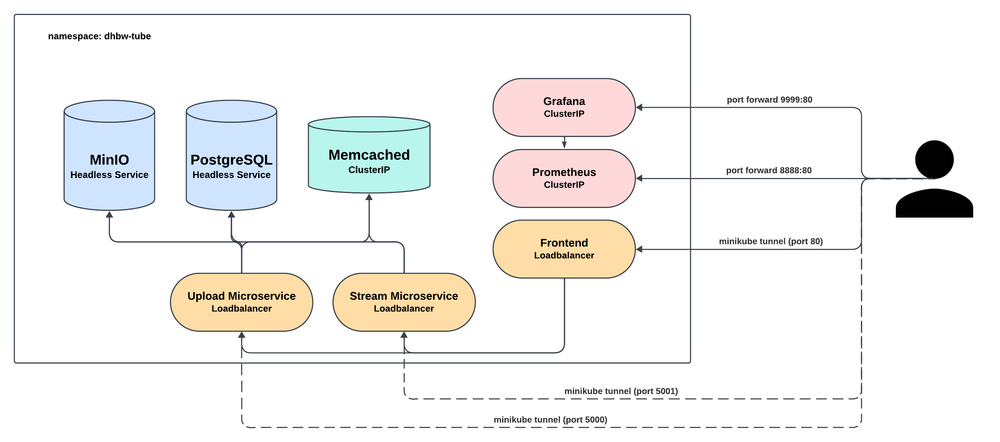

# DHBW Tube

DHBW-Tube is a cross-location web video platform for the exchange of user-generated content for students and employees of the Baden-Wuerttemberg Cooperative State University.
Users can search, view, and upload video clips on the portal for free.
Lecturers can upload lecture recordings, which can then be viewed by students who are absent due to illness or for exam preparation.
On the other hand, students have the opportunity to record their own learning videos on lecture content and share them with their fellow students.
The video description enables the video creators to add further information, provide suitable exercises and give further tips for successful learning. 
With DHBW-Tube, students from different disciplines and DHBW locations can exchange knowledge across campuses.
The videos can be streamed ad-free from various devices via the web browser on the decentralized platform and remain available for subsequent semesters.
The application was developed with the aim of minimizing data and does not require time-consuming registration to upload content.

<br>

## Application Structure
The DHBW-Tube application consists of the following three microservices, which are deployed in a Kubernetes environment:
- **Frontend**: The user interface of the application, which allows users to search, view, and upload videos.
- **Stream**: The streaming service that enables video streaming and metadata retrieval.
- **Upload**: The upload service that provides video uploads with thumbnail and text description.

This repository contains the Kubernetes resources required to deploy the application in a Kubernetes environment.

The source code of the microservices, on the other hand, is separated into three repositories, allowing the microservices to be developed independently.
To set up the Kubernetes environment, the three repositories should be cloned before running the deployment script. The following commands can be used to clone the repositories:
```bash
git clone https://github.com/cy-rae/dhbw-tube-frontend.git
git clone https://github.com/cy-rae/dhbw-tube-upload.git
git clone https://github.com/cy-rae/dhbw-tube-stream.git
```
In the repositories of the microservices, you will find additional README files that describe the microservices in detail.
The README file you are currently reading contains instructions for launching the application, as well as descriptions of the Kubernetes environment and the tools used.

<br>

## Prerequisites
To start the application (in development mode), the following tools and software components must be installed on your system:
- **Minikube**:
Minikube is required to create and manage a local Kubernetes environment. Install [Minikube](https://kubernetes.io/docs/tasks/tools/install-minikube/) according to the official instructions.
- **Kubectl**:
Kubectl is the command-line tool for interacting with Kubernetes clusters. If kubectl is not installed with Minikube, you can download and install it separately from the [Kubernetes website](https://kubernetes.io/docs/tasks/tools/install-kubectl/).
- **Skaffold**:
Skaffold is used to automate development and deployment cycles in Kubernetes. Install [Skaffold](https://skaffold.dev/docs/install/) according to the official instructions.
- **Helm**:
Helm is a package manager for Kubernetes that makes it easier to manage applications. Install [Helm](https://helm.sh/docs/intro/install/) according to the official instructions.
- **Docker Desktop**:
Docker is used to build and manage container images. Install [Docker Desktop](https://www.docker.com/products/docker-desktop/) according to the official instructions.
Make sure all the above components are correctly installed and available in your system path to successfully start and develop the application.

<br>

## Starting the Application
To start the application, open Docker Desktop and make sure the Docker Engine is running. 
Then, execute one of the following commands:
#### On MacOS / Linux:
```bash
bash run-dhbw-tube.sh
```
#### On Windows:
```shell
powershell -File run-dhbw-tube.ps1
```

<p style="margin-top: 40px"></p>

These commands each execute a script that automates the setup of a Kubernetes environment using Minikube, Skaffold, and Helm. The script performs the following steps:
1. **Start Minikube**: The script checks if Minikube is already running. If Minikube is not running, Minikube will be started.
2. **Delete Namespace**: If the **dhbw-tube** namespace already exists in the kubernetes node, it will be deleted. The script waits until the namespace is completely removed to ensure a clean environment.
3. **Create Kubernetes Environment**: The script uses **skaffold** to create the Kubernetes environment according to the configuration in the `skaffold.yaml` file.
4. **Add Prometheus Helm Repository**: The script checks if the **Prometheus Helm Repository** has already been added. If not, it adds the repository and updates the Helm repositories.
5. **Add Grafana Helm Repository**: The script checks if the **Grafana Helm Repository** has already been added. If not, it adds the repository and updates the Helm repositories.
6. **Install Prometheus and Grafana**: The script installs Prometheus and Grafana in the **dhbw-tube** namespace with the specified configurations.
7. **Start Minikube Tunnel**: The script starts the Minikube tunnel to allow access to the services in Minikube. You may need to enter your admin password to start the tunnel.

As soon as all resources have been successfully deployed, the application can be accessed via [localhost](http://localhost).

To ensure that all resources are fully deployed, you can check the status of the resources with the following command:
```bash
kubectl get all -n dhbw-tube
```

<p style="margin-top: 40px"></p>

If you want to access the Prometheus and/or Grafana user interfaces, you can set up port forwarding for those services using the following commands:
#### Prometheus:
```bash
kubectl port-forward svc/prometheus-server 8888:80 -n dhbw-tube
```
#### Grafana:
```bash
kubectl port-forward svc/grafana 9999:80 -n dhbw-tube
```
You can then access Prometheus at [localhost:8888](http://localhost:8888) and Grafana at [localhost:9999](http://localhost:9999).

<br>

## Starting the Application in Development Mode
To start the application in development mode, open Docker Desktop and make sure the Docker Engine is running. 
Then, execute one of the following commands:
#### On MacOS / Linux:
```bash
bash run-dhbw-tube-dev.sh
```
#### On Windows:
```shell
powershell -File run-k8s-dev.ps1
```

<p style="margin-top: 40px"></p>

These commands each execute a script that automates the setup of a Kubernetes environment using Minikube, Helm, and Skaffold. The script performs the following steps:
1. **Start Minikube**: 
The script checks if Minikube is already running. If Minikube is not running, Minikube will be started.
2. **Delete Namespace**:
If the **dhbw-tube** namespace already exists, it will be deleted. The script waits until the namespace is completely removed to ensure a clean environment.
3. **Add Prometheus Helm Repository**:
The script checks if the **Prometheus Helm Repository** has already been added. If not, it adds the repository and updates the Helm repositories.
4. **Add Grafana Helm Repository**:
The script checks if the **Grafana Helm Repository** has already been added. If not, it adds the repository and updates the Helm repositories.
5. **Create Kubernetes Environment**:
The script uses Skaffold to create the Kubernetes environment according to the configuration in the `skaffold.yaml` file.

The script executes the `skaffold dev` command, which displays log and status messages on the terminal for the duration of the development process.
During this process, the terminal is blocked because skaffold dev runs continuously in the background, monitoring the environment.
In addition, skaffold dev responds to changes in the source code and updates the container images and relevant Kubernetes resources accordingly.

To access the application via [localhost](http://localhost), the command `minikube tunnel` has to be executed additionally.
This command sets up a tunnel that allows access to services within the Minikube environment.

<p style="margin-top: 40px"></p>

It is important to note that Prometheus and Grafana are not automatically added when using `skaffold dev`.
The reason for this is that skaffold dev may uninstall existing Helm releases.
However, the Helm repositories for Prometheus and Grafana are added so that you can manually install these services if needed.
To add Prometheus and Grafana, you can use the following commands:
```bash
helm install prometheus prometheus-community/prometheus \
  --namespace dhbw-tube \
  -f k8s/prometheus/prometheus-values.yaml \
  --set server.global.scrape_interval="15s"
helm install grafana grafana/grafana \
  --namespace dhbw-tube \
  -f k8s/grafana/grafana-values.yaml
```

To access the Prometheus and Grafana user interfaces, you can set up port forwarding for those services using the following commands:
#### Prometheus:
```bash
kubectl port-forward svc/prometheus-server 8888:80 -n dhbw-tube
```
#### Grafana:
```bash
kubectl port-forward svc/grafana 9999:80 -n dhbw-tube
```
You can then access Prometheus at [localhost:8888](http://localhost:8888) and Grafana at [localhost:9999](http://localhost:9999).

<br>

## Kubernetes Environment
### Overview
- Skaffold is used to deploy the application, which enables automatic recovery of resources in the event of failures. 
- Most resources are defined in Kubernetes configuration files and are installed with kubectl.
- Prometheus and Grafana are installed via Helm.

In the following sections, the Kubernetes resources used in the DHBW-Tube application are described in detail.

<p style="margin-top: 40px"></p>

### PostgreSQL
A PostgreSQL database server is used to store the metadata of the uploaded files. The following resources are used for this:
- StatefulSet: Used for PostgreSQL to ensure that each instance has a stable network ID and stable storage. This is particularly important for databases that require consistent data storage and identity.
- Headless Service: Used in combination with StatefulSets to provide direct addressing to the pods without using a load balancer. This is important for database replication and partitioning.
- ConfigMap: Contains configuration data for the PostgreSQL server.
- PersistentVolumeClaim: Provides persistent storage for the PostgreSQL database to prevent data loss on pod restarts.

### MinIO
A MinIO database server is used to store the files that users upload.
- StatefulSet: Used to run MinIO with stable network IDs and persistent storage. This is important for file storage management as MinIO requires consistent identity and access to data.
- Headless Service: In combination with the StatefulSet, this allows MinIO to address its instances directly. This is important for managing and scaling the storage instances.
- PersistentVolumeClaim: Secures the storage space for the MinIO data and ensures continuous availability of the uploaded files.

### Upload Microservice
The upload microservice was developed in Python with the Flask web framework. This microservice provides REST-APIs to store videos, images and metadata.
- Deployment: Responsible for the deployment and scaling of the upload pods.
- Service (load balancer): Ensures that the upload service is accessible from the outside and optimizes the distribution of incoming REST-API requests sent from the frontend.
- ConfigMap: Contains configuration data for the upload service.

### Stream Microservice
The stream microservice was developed in Python with the Flask web framework. The microservice can be used to stream videos and images and retrieve metadata.
- Deployment: Responsible for the provision and scaling of the stream pods.
- Service (load balancer): Enables access to the stream service from the outside and optimizes the distribution of incoming REST API requests sent from the frontend.
- ConfigMap: Contains configuration data for the stream service.

### Memcached
Memcached is used to cache the video metadata. The reduced database requests are designed to ensure application performance. The cache is currently only used in the stream microservice for metadata requests, as the MinIO database is already optimized for file streaming.
- Deployment: Responsible for the provisioning and scaling of the Memcached pods.
- Service: Provides the Memcached service, which is used by other components to cache metadata.

### Frontend
The frontend was developed as a single page web application with the Quasar (Vue.js) framework. The build files are located on an nginx server, which coordinates the outgoing HTTP requests. This interface allows users to interact with the DHBW-Tube application.
- Deployment: Manages the deployment and scaling of the frontend pods.
- Service (load balancer): Enables external access to the user interface and optimizes the distribution of user requests.
- ConfigMap: Contains configuration data for the frontend server (nginx configuration).

### Prometheus
A Prometheus integration is used to collect data about the status of Kubernetes resources. Accordingly, the Deployments and StatefulSets have the necessary Prometheus annotations. Prometheus is installed with the following configuration files, resources and helm:
- PersistentVolume: Required to persist Prometheus data and ensure no data is lost on pod restarts.
- PersistentVolumeClaims: Ensures that the necessary storage space is provided for the Prometheus data.
- Helm Values: Configuration files used when installing Prometheus via Helm to make specific settings and customizations.

### Grafana
A Grafana integration is used to visualize the Prometheus data in dashboards. Grafana is installed with the following Kubernetes resources and Helm:
- PersistentVolume: Used to permanently store Grafana data and ensure that dashboards and configurations are not lost.
- PersistentVolumeClaims: Provides the required storage space for Grafana.
- Helm Values: Configuration files that are used when installing Grafana via Helm to make specific settings and customizations.

### Kubernetes Secrets
Kubernetes Secrets are objects used to store sensitive information such as passwords, tokens, and keys, which are essential for the secure operation of applications within a Kubernetes cluster.
By using Secrets, Kubernetes allows for the separation of sensitive data from application code and configuration files, reducing the risk of accidental exposure and unauthorized access.

It is considered best practice not to store Secrets YAML files in a repository to ensure security. 
Instead, these files should be stored and managed locally or in a secure secret management system such as HashiCorp Vault, AWS Secrets Manager, or Azure Key Vault. 
However, since this is a sample application for an academic project and not a production system, this approach has been bypassed, and the Kubernetes Secret files are included in the repository.

The following Secrets are used in the DHBW-Tube application:
- Postgres
- MinIO
- Grafana

<p style="margin-top: 40px"></p>

### Summary
The Kubernetes environment uses a combination of StatefulSets for stateful services such as databases and storage, and deployments for stateless microservices.
Headless services are used in conjunction with StatefulSets to ensure direct and consistent network identity.
Prometheus and Grafana are used to monitor and visualize system status, while Secrets are used to protect sensitive data.

The following image shows the high-level concept and communication between Kubernetes resources.
The user can access the frontend of the DHBW-Tube application and the user interfaces of Prometheus and Grafana.
Since the Upload and Stream microservices are externally accessible, the user can access them through the REST APIs (e.g. with tools like Postman). 
The frontend uses the REST-APIs of the upload and stream microservices, which in turn have connections to the PostgreSQL and MinIO databases.
The stream microservice also uses Memcached.
Grafana accesses the data from Prometheus and Prometheus scrapes data from the pods. 


<br>

## Preview
Below you can see some screenshots of the DHBW-Tube application.
### Upload Page


### Search Page


### Stream Page

